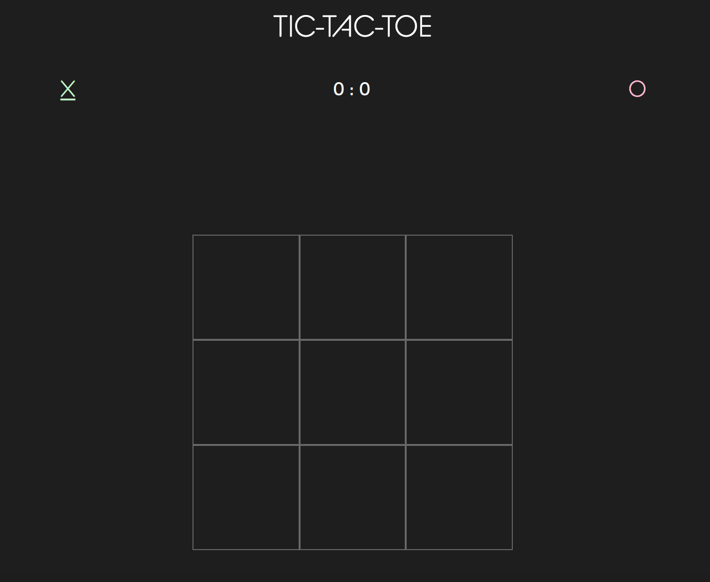

# Tic-Tac-Toe

A simple game of Tic-Tac-Toe (aka Noughts and Crosses). 

## Installation

Just load the page right here in your browser!

## Development

Technologies used: Html, CSS, Javascript

My approach to building the functionality of this game began with building the playing field/grid. Each playable square on the grid is accessed via the DOM and assigned to a variable. Each time a turn is played (via a click event), a function is run which:
- Checks the 'playerTurn' variable for an odd or even value to determine if 'X' or 'O' turn
- Adds text content of 'X' or 'O' to the clicked square
- Adds a class of 'X' or 'O' to the clicked square
- Adds 1 to the 'playerTurn' variable
- Checks the current class ('X', 'O', or none) of each square on the grid against all possible winning (or tying) grid states, using a series of if/else statements
- If a game-ending statement is found to be true, the page displays text content announcing the winner, or that the game was tied, as well as a 'play again' button

Once the game was working as per the project requirements, I decided to add a win counter to tally the score across multiple rounds, and added some CSS fade animations to some page elements for a smoother visual feel.

